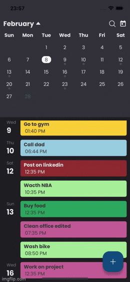
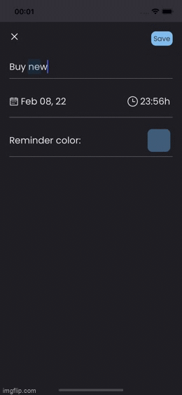
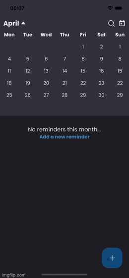

# CodellitCalendar
A nice way to manage reminders


## Features

- Add reminder
- Edit reminder
- Remove reminder
- List reminders by month
- Search reminders by text


## Demo

  


## Run Locally

Clone the project
```bash
  git clone https://gitlab.com/codelittinc/react-native-interview-project-paulo-torres.git
```


Install dependencies
```bash
  npm install
```

IOS extra step
```bash
  cd ios
  pod install
```

Android
```bash
  npx react-native run-android
```

IOS
```bash
  npx react-native run-ios
```

#### Possible errors on IOS first run
CodellitCalendar is using `react-native-vector-icons` library as icons provider.
Its link (fonts file) may cause a error when app runs on ios first time.
The focus of this challenge it's not resolveing this kind of problem, so, bellow has a short step-by-step to resolve this error provisionally:

```
xCode => App target => Build phases => Copy Pods Resources => clean all items on "Output Files List" section.
```

Clean the project and rebuild.


## Tech Stack

- React
- React Native
- Typescript
- React Hook Forms
- Yup
- React Navigation v6
- Redux (thunk)
- Styled components
- Async storage
- Moti (animations)


## A message for the Code Reviewers

- Guys, first, I would like to say that I am very happy for the opportunity and for this challenge delivered. It is something unique and has already served me as a sensational experience.

- You will notice that throughout the project I used constant values ​​for the width and height of some components. The idea was to provide more performance for the lists. With these constants, this task is simplified.

- At some points in the project, I left some comments about what I would have done in a real use case but I chose not to include it in this challenge because I believe this is not the focus.

- Context API + Redux: Although I chose to use React's Context API, all state management was created using Redux exclusively. The role of the Contex API is to abstract the available actions of the App into a context. This is to avoid repeating rules across components.

- Responsive layout:
With React Native and its eco system, we have a few ways to provide a nice layout for users regardless of their device. I used React Native's own API in this challenge: PixelRatio.

- Summary Comments: In some functions, I used sumarry comments. It's a practice that I really like and that, due to time, I couldn't spread it throughout the app. So I left some just for example.


## Authors

- [@PHTorres](https://www.github.com/phtorres)


## 🚀 About Me
- I’m currently working on <a href="https://www.bennu.com.br/" target="_blank"> BennuTV</a> Mobile Apps;
- I’m currently learning .NET 6 and React Native Animations with Moti Lib;
- I’m looking to collaborate on React or React Native products;
- Ask me about React Native, React, .NET, C# and TypeScript;

